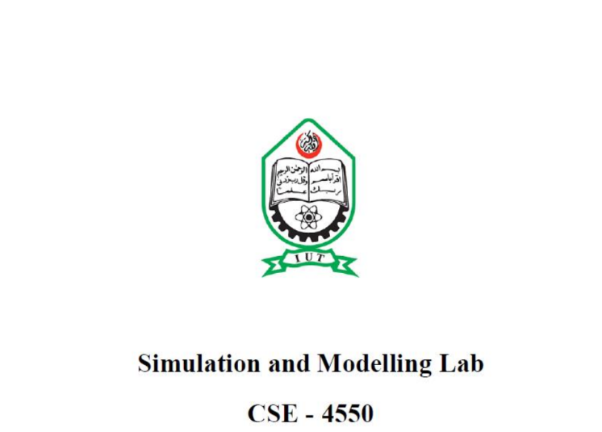
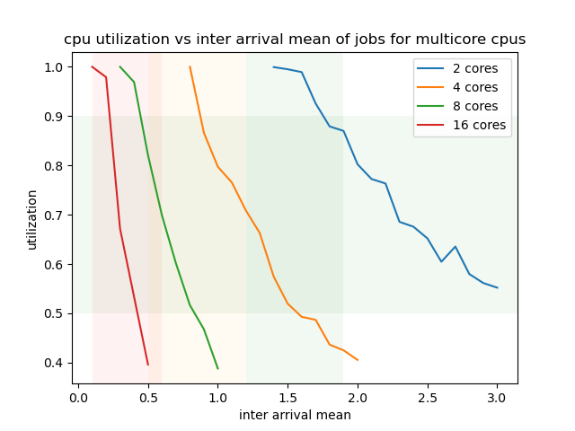

# Report on Cpu Simulation

>Name: Md  Abdullahil Kafi
>
>ID: 190041224
>

## Introduction

A CPU simulation is a computer program that mimics the behavior of a central processing unit (CPU) in a computer system. It is used to model and analyze the performance of different algorithms, architectures, and operating systems. CPU simulations can be used for a variety of purposes, such as:

- Performance evaluation: CPU simulations can be used to measure the performance of different algorithms and architectures in terms of throughput, latency, and energy consumption.

- Design space exploration: CPU simulations can be used to explore the design space of different architectures and identify the best configuration for a given workload.

- Testing and validation: CPU simulations can be used to test and validate new algorithms and architectures before they are implemented in real systems.

- Education and training: CPU simulations can be used to teach students about computer architecture and operating systems.

There are several types of CPU simulations, such as:

- Cycle-accurate simulations: These simulations model every clock cycle of the CPU and are used to measure the performance of specific algorithms and architectures with high accuracy.

- Functional simulations: These simulations model the behavior of the CPU at a higher level of abstraction and are used to explore the design space of different architectures.

- Emulation: These are simulations that model the behavior of an actual CPU and can be used to run real applications on a simulated platform.

CPU simulations are a powerful tool for analyzing and optimizing the performance of computer systems. They can help in understanding the behavior of complex algorithms, architectures and operating systems, and can aid in the design of new and improved systems.

## Simulation description

This simulation is aimed at multicore performance evaluation with functional simulation. The simulation environment has the following rules:

- There is one cpu in the system.
- There can be multiple cores (2,4,8,16) in the cpu.
- The cpu has to execute a job when a job is available in its job queue.
- Jobs are executed in a FIFO fashion.
- Jobs arrive at the cpu with an exponential random inter arrival time with a mean.
  - The mean determines the load on the cpu.
  - The lower the mean, the higher the load.
- Each job has a serial part and a parallel part at random with a gamma distribution.
- The parallel part is broken down into a number of parts which become independent jobs with full serial fraction.
  - These jobs are child jobs.
- The serial part is now an independent job with full serial fraction.
  - The serial part that becomes independent is the mother job.
- The mother job cannot leave the system until all the child jobs finish their execution.
- The core which executed the mother job however does not need the mother job to leave the system before starting execution of the next job.
- The cores become idle when it finished one job and there is no job in its job queue.
- The simulation continues until 1000 jobs are successfully completed.

## Simulation Objective

The objective of the simulation is to evaluate the performance of cpus with multiple cores.

## Simulation Output

The figure above is the plot of cpu utilization of every simulation. Different part of the graph is shaded.

We can see a horizontal green shade parallel to the x-axis. This shad represents the normal utilization of a cpu. The region is between .5 and .9 on the y-axis. This represents that on average a normal cpu utilizes 50% to 90% of the total utilization and it is normal.

There are three vertical shaded regions in the graph. The red shaded region shows use case for workstations with average inter arrival mean between .1 and .6. The orange shaded region shows the use case for gaming with average inter arrival mean between .5 and 1.2. The green shaded region shows the use case for general use cases.

From the graph it can be seen that dual-core cpus can barely be used for general use cases. and for most of the time, the cpu will stay more than 90% utilized. That means there will be significant delay between jobs and the computer will be too slow to operate regularly.

It can also be seen that quad-core cpus are largely dominant in the general use case scenario and are also capable of handling some low-mid tier gaming. The price for quad-core cpus are significantly lower than that of octa-core cpus. That's why we see that quad-core cpus are dominant choice for the average consumers who also want a decent amount of gaming.

From the graph it can be seen that if we want to play some high level games with high graphics, we need more than just 4 cores. Octa-core cpus come in straight with significant performance for high-end games keeping utilization within a good range. But the price of Octa-core cpus are comparatively high for average consumers but it still remains a wish for average consumers to own one of these. Octa-core cpus outperforms quad-core cpus in gaming by a large margin and is also pretty decent at workstation handling. So, if we want to build a personal workstation at home, a Octa-core cpu might just barely meet the need.

For real workstations though, 16-core cpus are a must. We see a steep slope for the plot of both 8-core and 16-core cpus. The reason is for a small decrement of inter arrival time, the load on the cpu increases by many folds. So only those who can afford them can buy and hope the cpu remains most of the time busy. As we see with small increment of inter arrival time, the cpu utilization drops significantly. That's the reason why servers typically need more cores with lower clock rate than less cores with higher clock rate.
